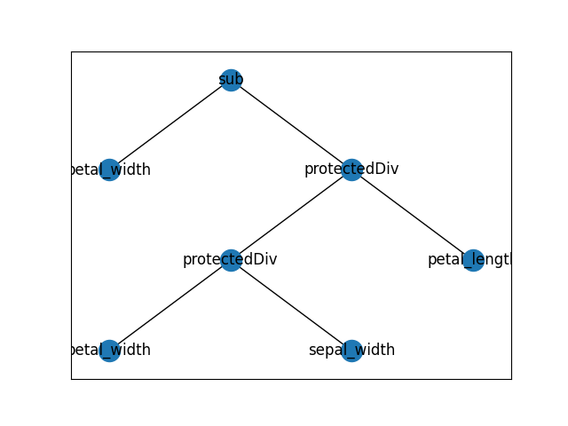

# Classification example using genetic programming 

## Description

This project presents an example of using genetic programming (GP) and machine learning (ML) to perform classification work. 
Specifically, the iris dataset, which is known to be a testbed for numerous artificial intelligence applications, is used. 

## Features


## Structure

The project is structured as follows:
- **example**: contains the examples of the model, primitives and expression tree image.
- **inference.py**: script to perform the inference.
- **LICENSE**: contains the software license.
- **main.py**: main script, performs model training.
- **README.md**: describes the project.
- **requirements.txt**: contains the list of dependencies.
- **utils.py**: contains utilities needed by the software.
- **visualize.py**: allows the expression tree of a given model to be displayed.


## Quick start 

In order to run the project, you must have configured the Python environment and the necessary dependencies.

To install the dependencies:

``` pip install -r requirements.txt```

Once the environment is configured, training can be performed with the command: 

```python main.py```

In the inference step, it is necessary to specify the model path to be used and optionally the number of canidates to be examined:

```python inference.py <model_path> <optional_n_samples>```

Finally, you can view the expression tree of a saved model:

```python visualize.py <model_path>```


## Examples

The folder ***esempi*** contains the results of the training and inference phase. Specifically:
- **best_individual.pkl**: contains the serialized model that will be used later for the inference step.
- **best_individual.txt**: contains the expression in a human-interpretable format.
- **primitive_set.pkl**: contains the primitives used.
- **prmitives**: contains the primitives in a human-readable format.
- **tree.png**: shows the model (expression) obtained from training.

The image below shows an example of a model produced by the algorithm. In this case, of the 4 features available in the dataset, only 3 are used: ***petal_width***, ***sepal_width***, ***petal_length***.




## License
This project is distributed under the MIT License. See the LICENSE file included in the repository for complete terms.